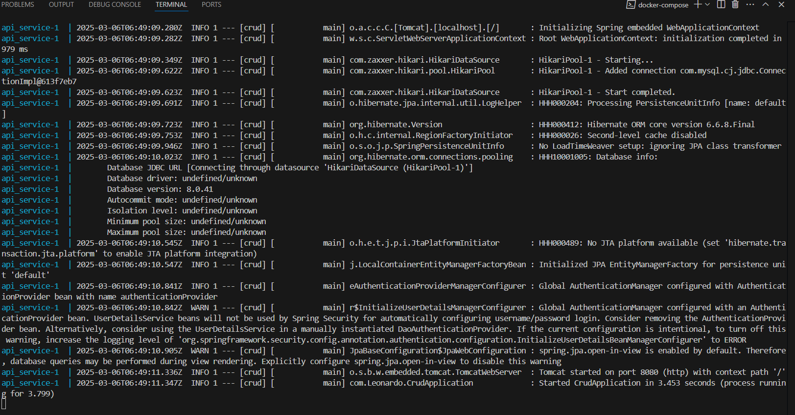

Tarea 3
En esta tarea se realizo una aplicacion con spring boot usando una base de datos
Este proyecto cuenta con un login y un crud si eres admin
Ademas de eso se utilizo docker para poder correr el programa
Para ocupar esto debes de tener instalado docker 
y solo tienes que ejecutar
docker-compose up --build
las capturas de pantalla del funcionamiento 

